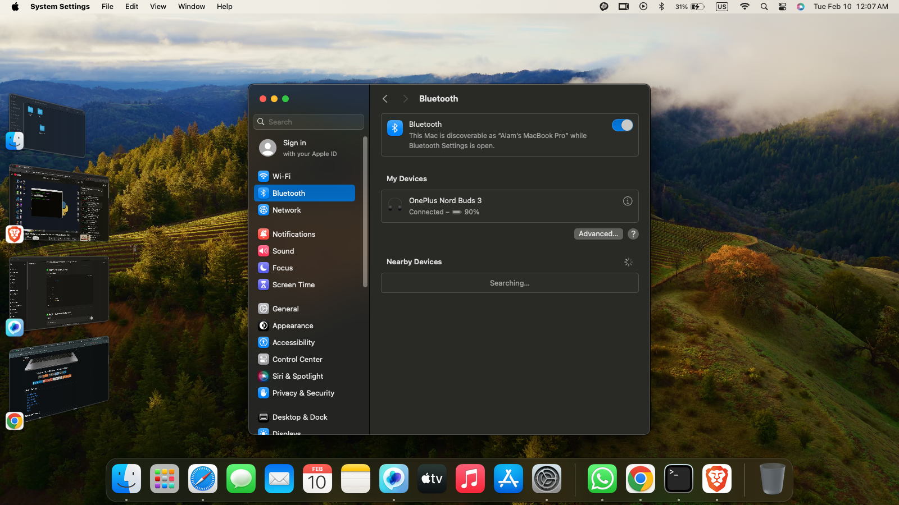
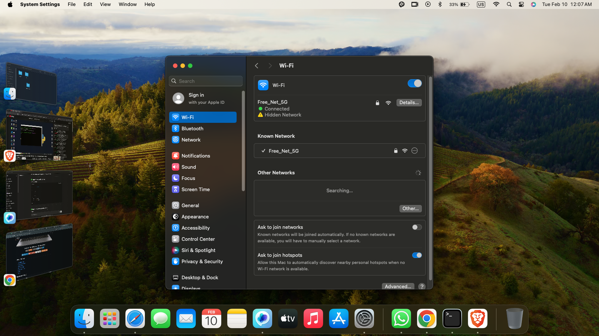
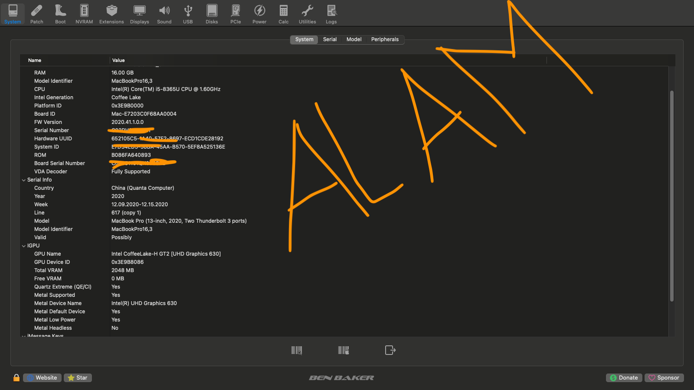
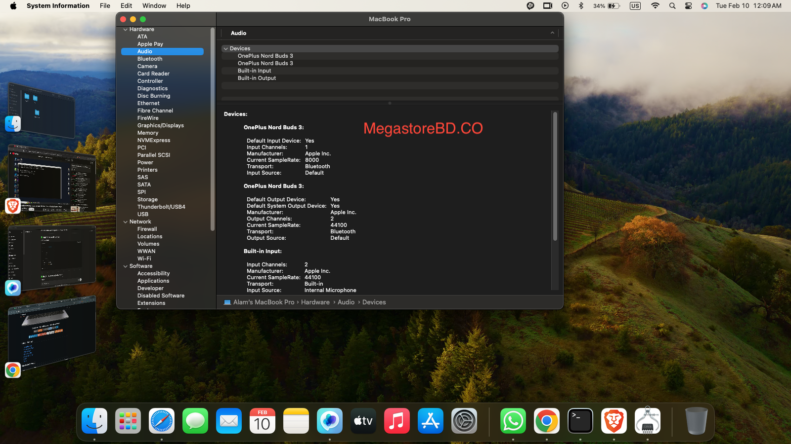
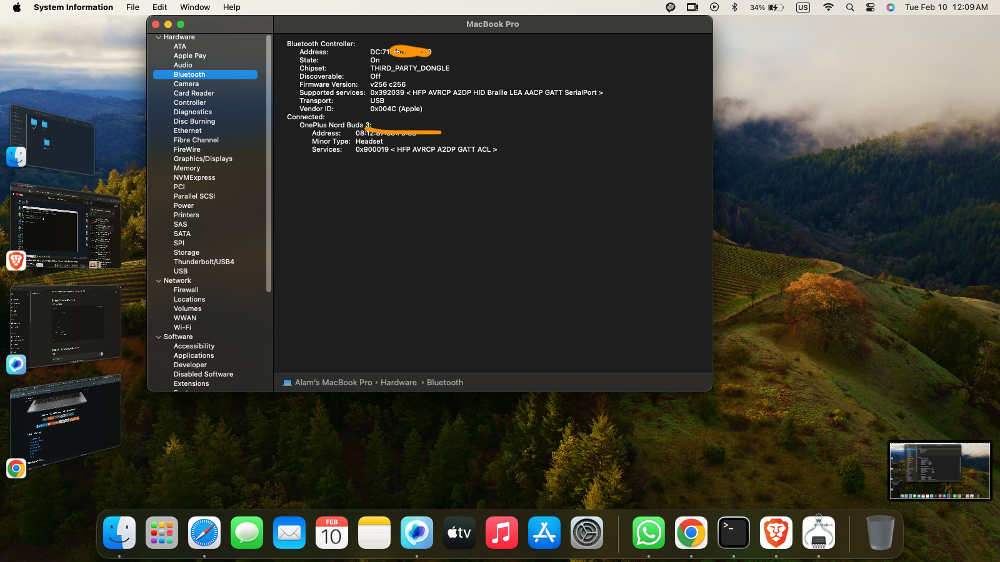
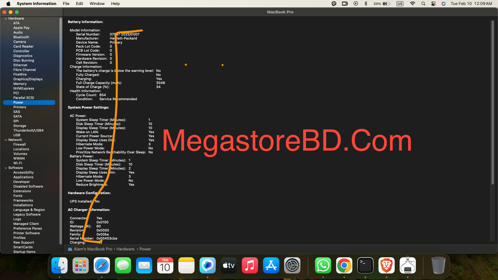

# 💻 HP EliteBook 840 G6 Hackintosh (macOS Sonoma)

Stable, daily-driver ready OpenCore EFI for HP EliteBook 840 G6.

---

## 📌 Overview

This repository provides a stable and optimized OpenCore EFI configuration for running macOS Sonoma on the HP EliteBook 840 G6.

Designed for:

- Stability
- Performance
- Real daily usage
- Clean OpenCore configuration

---

## 💻 Hardware Specifications

| Component | Model |
|---|---|
| Laptop | HP EliteBook 840 G6 |
| CPU | Intel Core i5-8365U |
| GPU | Intel UHD Graphics 620 |
| RAM | 16GB |
| Storage | 256GB NVMe (PNY) |
| WiFi | Intel (AirportItlwm) |
| Audio | AppleALC |

---

## 🍎 Tested macOS Versions

✅ macOS Sonoma

---

## 🔧 Bootloader

- OpenCore

---

## ✅ Working Features

- Full Graphics Acceleration
- Audio
- WiFi
- Bluetooth
- Sleep / Wake
- Battery Status
- Brightness Control
- Trackpad Gestures
- Keyboard
- Power Management

---

## ❌ Known Issues

- None reported (stable for daily use)

---

## 🚀 Installation Guide

1. Generate your own SMBIOS using **GenSMBIOS**.
2. Replace PlatformInfo section inside `config.plist`.
3. Copy EFI folder to EFI partition.
4. Boot using OpenCore.

---

## 📸 Screenshots

---

## ⚠️ Important Notes

- Personal serial numbers removed for safety.
- Always generate your own SMBIOS.
- EFI intended for HP EliteBook 840 G6 (i5-8365U).

---

## 👨‍💻 Maintainer

- Alam Hossain (MegastoreBD.Com)

---

## 🙏 Credits

- Acidanthera (OpenCore Team)
- Dortania OpenCore Install Guide
- Hackintosh Community
